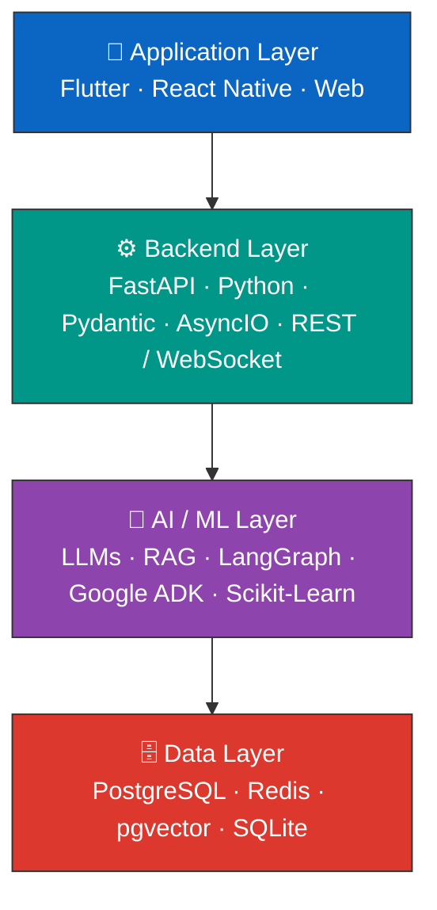

# Jayant Bhatia

### AI Systems & Software Engineer

**Generative AI · Agentic AI · RAG · Python · FastAPI · Distributed Systems**

Building production-grade AI and software systems — from LLM-powered agents, RAG pipelines,
and model inference to scalable backend APIs, data systems, and cross-platform applications.

  
  
  

  

 

 

## About Me

I'm a **Software Engineer focused on Generative AI, Agentic AI, backend engineering, and machine learning systems.**

My work spans the full lifecycle of AI-powered applications:

- **Generative AI & Agentic Systems** — LLM applications, RAG pipelines, multi-agent workflows, tool calling, structured outputs, and evaluation
- **Backend & API Engineering** — Python, FastAPI, async services, REST APIs, WebSockets, authentication, validation, caching, and database integration
- **Data & ML Engineering** — data preprocessing, feature engineering, model development, evaluation, inference pipelines, and model serving
- **Production Engineering** — Docker, CI/CD, automated testing, observability, and production-oriented system design
- **Application Development** — Flutter, React Native, and web apps integrated with AI and backend services

> My focus isn't only on building models or prototypes — it's on turning AI capabilities into
> **reliable software systems** that can be integrated, tested, deployed, and consumed by real applications.

 

## System Architecture

**Engineering approach:** combine deterministic software engineering with AI capabilities —
traditional code handles business rules, validation, and system control, while LLMs are used
where reasoning, language understanding, and generation provide measurable value.

 

## What I Build

<table>
<tr>
<td width="50%" valign="top">

### 🤖 Generative AI & Agentic Systems
Designing AI applications around LLMs, RAG, agents, and tool-enabled workflows.

- Multi-agent systems (LangGraph, state-based orchestration)
- Retrieval-Augmented Generation pipelines
- Vector search & semantic retrieval
- Tool calling & structured outputs (Pydantic / JSON Schema)
- Prompt engineering & context management
- LLM evaluation & regression testing
- Guardrails & prompt-injection defenses
- Local and cloud model inference

</td>
<td width="50%" valign="top">

### ⚙️ Backend & Distributed Systems
Building reliable backend services around AI and application logic.

- Python & FastAPI
- Async programming (AsyncIO)
- REST API design
- WebSockets & Server-Sent Events
- PostgreSQL / MySQL / SQLite
- Redis caching & state management
- Background workers & queues
- Docker, Docker Compose & CI/CD

</td>
</tr>
<tr>
<td width="50%" valign="top">

### 🧠 Machine Learning
End-to-end ML pipelines from data preparation through inference.

- Exploratory data analysis
- Data preprocessing & feature engineering
- Classification & regression
- Random Forest / gradient-boosting models
- Model evaluation & threshold optimization
- Precision / recall analysis & cross-validation
- Model serialization & inference APIs

</td>
<td width="50%" valign="top">

### 📱 Application Engineering
Connecting backend and AI services to production-grade clients.

- Flutter & React Native
- ReactJS
- REST API & WebSocket integration
- State management & local persistence
- Authentication
- Mobile app deployment

</td>
</tr>
</table>

 

## Engineering Stack

<table>
<tr><th align="left">Category</th><th align="left">Technologies</th></tr>
<tr><td><b>Generative AI</b></td><td>LLMs, RAG, Agentic AI, Prompt Engineering, Tool Calling</td></tr>
<tr><td><b>AI Frameworks</b></td><td>LangGraph, LangChain, Google ADK</td></tr>
<tr><td><b>Backend</b></td><td>Python, FastAPI, AsyncIO, REST, WebSockets, SSE</td></tr>
<tr><td><b>Databases</b></td><td>PostgreSQL, MySQL, SQLite, Redis, pgvector</td></tr>
<tr><td><b>Machine Learning</b></td><td>Scikit-Learn, XGBoost, Pandas, NumPy</td></tr>
<tr><td><b>Infrastructure</b></td><td>Docker, Docker Compose, GitHub Actions</td></tr>
<tr><td><b>Applications</b></td><td>Flutter, React Native, ReactJS</td></tr>
<tr><td><b>Engineering Practice</b></td><td>Git, Linux, Automated Testing, CI/CD, API Design</td></tr>
</table>

 

## Current Engineering Direction

My primary focus is **production-grade AI engineering** — building systems where AI is one
component of a larger, reliable architecture, rather than an LLM call being the entire application.

 

### 📊 GitHub Stats

  

**Let's connect and build something great.**

