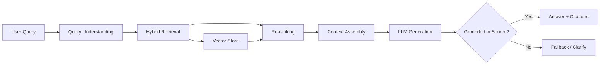
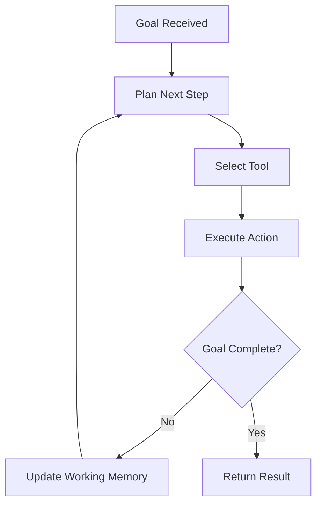
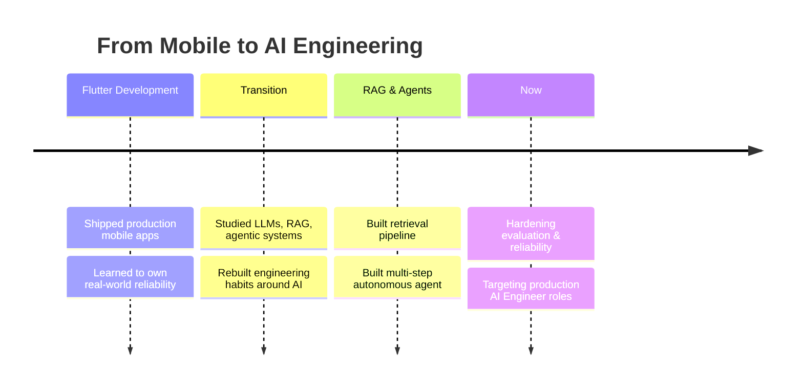

 

  

`AI Engineering` &nbsp;·&nbsp; `LLM Systems` &nbsp;·&nbsp; `RAG` &nbsp;·&nbsp; `Autonomous Agents` &nbsp;·&nbsp; `Production ML`

 

## The Shift

I started as a **Flutter developer** — where every crash, every millisecond of jank, was my problem in production, not in a notebook.

That discipline followed me into AI.

Most engineers enter AI through research and learn production discipline the hard way, after something breaks live. I came the other direction — I already knew what "in production" costs, and I bring that standard to every model, pipeline, and agent I build.

 

## How a Request Moves Through My Systems

Rather than describe the RAG pipeline in prose, here's the actual shape of it:

And the agent reasoning loop behind the automation system:

*Design choices, not defaults: re-ranking exists because naive top-k retrieval was returning plausible-but-wrong context. The fallback branch exists because I'd rather the system say "I don't know" than hallucinate an answer.*

 

## What I Build

<table width="100%">
<tr>
<td width="50%" valign="top">

**🔎 RAG-Based Intelligent Chatbot**

Retrieval-grounded Q&A over a custom knowledge base, built to minimize hallucination rather than just demo well on easy queries.

**Problem it solves:** generic LLMs don't know your org's data — and naive RAG returns confident nonsense. This pipeline prioritizes retrieval precision and traceable answers.

`LangChain` `LLMs` `Vector Retrieval` `Prompt Engineering`

</td>
<td width="50%" valign="top">

**⚙️ AI Agent Automation System**

An autonomous agent that plans across multiple steps, selects tools, and executes workflows with minimal human input.

**Problem it solves:** most "AI automation" is one prompt in a trench coat. This reasons about *what to do next*, not just what to say next.

`AI Agents` `Tool Use` `LLM Orchestration` `APIs`

</td>
</tr>
</table>

 

## Stack

<table width="100%">
<tr><th align="left" width="22%">Domain</th><th align="left">Tools</th></tr>
<tr><td><b>AI Engineering</b></td><td>LLMs · LangChain · RAG · Prompt Engineering · AI Agents</td></tr>
<tr><td><b>Backend & APIs</b></td><td>Python · REST APIs</td></tr>
<tr><td><b>Data & Query</b></td><td>SQL · Pandas · NumPy</td></tr>
<tr><td><b>Mobile (background)</b></td><td>Flutter · Dart</td></tr>
<tr><td><b>Tooling</b></td><td>Git · GitHub</td></tr>
</table>

 

## How I Work

| Principle | In practice |
|---|---|
| **Ship over demo** | A pipeline that works on 3 curated questions isn't done — it's a prototype. |
| **Traceable AI** | If a system can't explain *why* it answered something, I don't trust it in production. |
| **Engineering first** | Latency, cost, and failure modes matter as much as model choice. |
| **Narrow and reliable beats broad and flaky** | I'd rather ship an agent that reliably does one thing than one that sometimes does five. |

 

## Roadmap

 

<b>Currently exploring</b> (click to expand)

 

- Hybrid retrieval — combining dense + sparse search for better recall on ambiguous queries
- Agent evaluation — moving past "it worked in my test run" toward measurable reliability
- Multi-agent coordination — where a single agent's context window becomes the bottleneck
- Cost-aware LLM architecture — same output quality, lower latency and spend

 

## GitHub Activity

 

## Let's Talk

Open to **AI Engineer** roles where I can own systems end-to-end — not just tune prompts.

  

